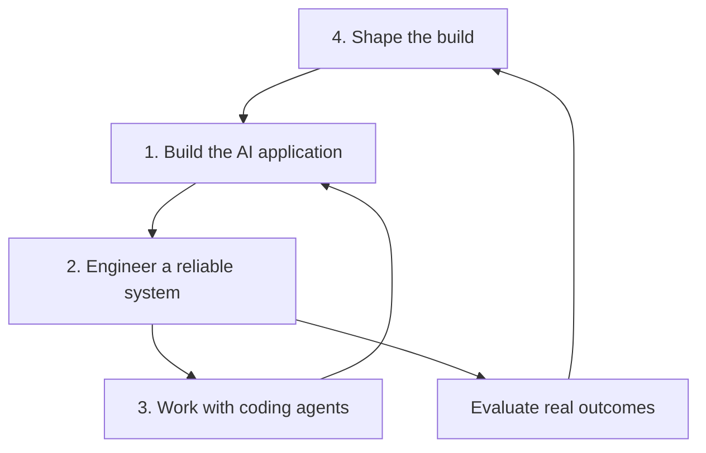

# AI Engineering Knowledge Base

## Foundation, structure and conceptual framework

**Status:** foundation version 0.1  
**Purpose:** provide a coherent knowledge base for learning, teaching and practising AI Engineering  
**Primary organising framework:** Andrew Ng's *AI Engineering Skills Map* (2026)

---

## 1. Purpose and scope

AI Engineering is the discipline of designing, building, evaluating, deploying and improving software systems in which AI models perform part of the system's work. It combines AI knowledge, software engineering, effective use of coding agents and the judgement required to decide what should be built.

This knowledge base is organised around the four areas in Andrew Ng's AI Engineering Skills Map:

1. **Building and deploying AI applications**
2. **Software engineering fundamentals**
3. **Using coding agents**
4. **Shaping the build**

Ng presents these areas as mutually reinforcing. AI applications contain probabilistic components, so reliable engineering requires strong software foundations, disciplined evaluation and iterative improvement. Coding agents accelerate implementation, but make specification, architecture, verification and human judgement more—not less—important. Shaping the build connects engineering activity to genuine user and organisational value.

Ng's detailed follow-up for Area 1 identifies six subskills: LLM foundations, grounding models with data, building agentic systems, evaluation-driven development, operating in production and machine-learning foundations. The more detailed structures for Areas 2–4 below are a reasoned extension of the top-level map, intended as a practical curriculum and knowledge architecture rather than a claim that Ng specified each concept.

## 2. How to navigate the knowledge base

The four areas can be read as a continuous engineering cycle:



Each concept page should eventually use the same template:

1. **Definition** — what the concept means.
2. **Why it matters** — which problem it solves.
3. **How it works** — the underlying mechanism.
4. **Engineering choices** — alternatives and trade-offs.
5. **Worked example** — preferably one continuing case.
6. **Failure modes** — common mistakes and risks.
7. **Evaluation** — evidence that the implementation works.
8. **Practice** — an exercise or small build.
9. **Related concepts** — links across the four areas.
10. **Sources** — primary documentation and research.

## 3. Recommended repository structure

```text
ai-engineering-knowledge-base/
├── README.md
├── 00-foundations/
│   ├── what-is-ai-engineering.md
│   ├── ai-system-lifecycle.md
│   ├── deterministic-and-probabilistic-systems.md
│   └── glossary.md
├── 01-building-deploying-ai-applications/
│   ├── README.md
│   ├── machine-learning/
│   ├── deep-learning/
│   ├── llms/
│   ├── context-engineering/
│   ├── rag-and-grounding/
│   ├── mcp-and-tools/
│   ├── agentic-workflows/
│   ├── evals/
│   └── production-operations/
├── 02-software-engineering-fundamentals/
│   ├── README.md
│   ├── requirements-and-design/
│   ├── architecture/
│   ├── code-quality/
│   ├── testing/
│   ├── data-engineering/
│   ├── security-privacy-safety/
│   ├── devops-observability/
│   └── teamwork-and-governance/
├── 03-using-coding-agents/
│   ├── README.md
│   ├── foundations/
│   ├── agent-loop-and-tools/
│   ├── context-and-instructions/
│   ├── configuration-and-permissions/
│   ├── working-method/
│   ├── multi-agent-systems/
│   ├── orchestration/
│   └── evaluation-and-governance/
├── 04-shaping-the-build/
│   ├── README.md
│   ├── problem-framing/
│   ├── users-and-workflows/
│   ├── product-discovery/
│   ├── feasibility-value-risk/
│   ├── specification-and-acceptance/
│   ├── responsible-ai/
│   └── outcomes-and-learning/
├── cases/
├── patterns/
├── anti-patterns/
├── labs/
└── references/
```

---

# Area 1 — Building and deploying AI applications

## Conceptual story

An AI application is not simply an ordinary application with a model attached. Part of its behaviour is probabilistic: the same type of input can produce different outputs, and plausible output can still be wrong. The AI engineer therefore creates reliability around an inherently imperfect component.

The story starts with understanding the model family. Classical machine learning learns mappings from data; deep learning learns representations with neural networks; LLMs generate language and other modalities token by token. A useful application then supplies the model with the right context, grounds it in trusted data, gives it tools where necessary and arranges model calls into a workflow. Evals guide every iteration. Production engineering adds security, observability, cost control, latency management and feedback loops.

The key movement is:

> **model capability → relevant context → controlled action → measured behaviour → reliable production system**

## Concepts

| Concept | Explanation |
|---|---|
| **Artificial intelligence (AI)** | The broad field of systems that perform tasks associated with perception, prediction, reasoning, language, planning or action. In engineering, AI is a system component rather than a complete product. |
| **Machine learning (ML)** | Methods that learn patterns from data instead of expressing every rule explicitly. Core forms include supervised, unsupervised, self-supervised and reinforcement learning. Engineers need data splits, loss functions, metrics, generalisation, bias–variance reasoning and error analysis. |
| **Deep learning (DL)** | Machine learning using multilayer neural networks. It underpins modern vision, speech, multimodal systems and LLMs. Important concepts include tensors, embeddings, architectures, training, inference, optimisation, transfer learning and compute requirements. |
| **Foundation model** | A model trained broadly enough to be adapted to many tasks. Adaptation can occur through prompting, tool use, retrieval, fine-tuning or specialised wrappers. |
| **Large language model (LLM)** | A foundation model that processes and generates sequences of tokens. Practical understanding includes tokenisation, embeddings, attention, context windows, inference, sampling, structured output, reasoning effort, caching, tool calling and model limitations. |
| **Multimodal model** | A model that can process or generate more than one modality, such as text, images, audio or video. The engineer must decide how modalities are represented, combined, validated and evaluated. |
| **Model selection** | Choosing a model or model portfolio based on capability, reliability, latency, cost, privacy, context size, modality and deployment constraints. The largest model is not automatically the best production choice. |
| **Prompt engineering** | Designing instructions and examples that elicit useful model behaviour. It includes task definition, constraints, output schemas, examples and explicit uncertainty handling. A prompt is only one part of the context. |
| **Context engineering** | Designing the complete information environment available to a model at a particular step: instructions, conversation, retrieved knowledge, tool definitions, state, examples and output constraints. It also includes selecting, compressing, ordering and refreshing context. |
| **Grounding** | Connecting model output to trusted, task-relevant sources or system state. Grounding reduces unsupported generation and enables answers that reflect current or private information. |
| **Retrieval-augmented generation (RAG)** | A pattern in which relevant information is retrieved and supplied to the model during inference. A RAG pipeline typically covers ingestion, parsing, chunking, metadata, indexing, retrieval, reranking, context assembly, generation and citation. |
| **Embeddings and vector search** | Embeddings represent content as numerical vectors; vector search retrieves items with similar representations. It is useful for semantic similarity, but exact search, filters, SQL, graphs or hybrid retrieval may be better for other query types. |
| **Knowledge graph and semantic layer** | Alternatives or complements to vector retrieval. A knowledge graph makes entities and relationships explicit; a semantic layer gives consistent business meaning to structured data and metrics. |
| **Tool calling** | Allowing a model to request a defined operation, such as querying a database, running code or calling an API. The application—not the model—must validate arguments, permissions, results and side effects. |
| **Model Context Protocol (MCP)** | An open protocol for connecting AI applications to tools, data sources and reusable capabilities through standard interfaces. MCP improves interoperability; it does not remove the need for authentication, authorisation, validation and trust boundaries. |
| **Agentic workflow** | A system that uses one or more model calls to perform a multi-step task. Some workflows have a fixed graph; more autonomous agents repeatedly select their own next action within a harness. |
| **Agent harness** | The runtime around a model that manages instructions, tools, state, memory, permissions, stopping conditions, retries, traces and human intervention. Much of an agent's practical capability comes from the harness, not only the model. |
| **Workflow pattern** | Reusable arrangements such as prompt chaining, routing, parallelisation, orchestrator–worker, evaluator–optimizer and human approval. The simplest architecture that meets the need is generally easiest to evaluate and operate. |
| **Memory and state** | State records what is true during a workflow; memory makes selected information available across steps or sessions. Both require scope, retention, privacy, freshness and conflict policies. |
| **Guardrail** | A control that constrains inputs, outputs or actions. Guardrails may be deterministic rules, classifiers, policy checks, permission gates or human review. They complement rather than replace system design and evaluation. |
| **Eval** | A structured test of AI-system behaviour using representative inputs, expected properties and scoring methods. Scores may be deterministic, model-based or human. Evals should measure the application, not just the underlying model. |
| **Evaluation-driven development** | A development loop in which desired behaviour is stated as evaluable criteria, a baseline is measured, errors are analysed, one change is made and regressions are checked. Evals play a role analogous to tests, while accounting for probabilistic output. |
| **Error analysis** | Inspecting failures, clustering them into meaningful categories and deciding which change is most likely to improve the system. Aggregate scores without qualitative error analysis rarely indicate what to build next. |
| **Production operation** | Running the system under real constraints: deployment, scaling, tracing, observability, drift detection, incident response, fallback, rollback, data freshness and version management. |
| **AI observability** | Capturing inputs, retrieved context, tool calls, outputs, latency, token use, cost, user feedback and safety signals while respecting privacy. Traces make multi-step failures diagnosable. |
| **Cost and latency engineering** | Controlling model choice, token volume, caching, retrieval, parallelism and number of calls. Quality, speed and cost must be evaluated as a system-level trade-off. |
| **Human in/on the loop** | Designing meaningful human authority. *In the loop* usually means approval or contribution is required; *on the loop* means people supervise and can intervene. The control must match consequence and reversibility. |

### Minimum learning path

1. Build a single-model application with structured output.
2. Add a small eval set and baseline.
3. Ground the model in a trusted document collection.
4. Add one read-only tool and validate its contract.
5. Turn the solution into a controlled multi-step workflow.
6. Add traces, security controls, cost monitoring and a feedback loop.

---

# Area 2 — Software engineering fundamentals

## Conceptual story

AI changes how software is produced, but it does not suspend the properties good software must have. Systems still need comprehensible requirements, coherent architecture, correct data, maintainable code, secure interfaces, repeatable deployments and operational accountability. In fact, rapid code generation increases the rate at which poor decisions can enter a codebase.

Software fundamentals provide the constraints and verification mechanisms within which models and coding agents can contribute safely. They let an engineer recognise when generated code is locally plausible but systemically wrong. The goal is not merely to make the code run; it is to create a system that can be understood, changed, tested, operated and trusted over time.

The key movement is:

> **working code → engineered system → verifiable quality → sustainable operation**

## Concepts

| Concept | Explanation |
|---|---|
| **Computational thinking** | Decomposing problems, identifying abstractions, designing algorithms and reasoning about state, complexity and failure. It is essential for assessing an agent's proposed solution. |
| **Programming fundamentals** | Data structures, control flow, functions, types, errors, concurrency, resource use and language idioms. These form the vocabulary for creating and reviewing software. |
| **Requirements engineering** | Eliciting, analysing, specifying, validating and managing functional and quality requirements. AI features additionally require behavioural examples, uncertainty policies and escalation rules. |
| **Software design** | Dividing responsibilities among components, defining interfaces and making trade-offs explicit. Good design limits the scope of AI uncertainty and keeps deterministic rules deterministic. |
| **Architecture** | The system's high-impact structural decisions: boundaries, components, integration, data flow, deployment and quality attributes. Architecture should make model replacement and workflow evolution possible. |
| **API and contract design** | Defining stable interfaces, schemas, validation, errors, idempotency and versioning. Tool contracts for agents are APIs and deserve the same discipline. |
| **Data modelling** | Representing entities, relations, events, constraints, lineage and lifecycle. AI does not compensate for ambiguous semantics or poor-quality source data. |
| **Code quality** | Readability, cohesion, low coupling, appropriate abstraction, consistency and explicit intent. Generated code must meet the same maintainability standard as human-written code. |
| **Version control** | Recording and reviewing changes using branches, commits, diffs and merge workflows. Small, coherent changes make agent output easier to inspect and reverse. |
| **Testing pyramid** | Combining unit, integration, contract, system and acceptance tests. Traditional tests verify deterministic behaviour; evals verify probabilistic behaviour. Both are needed in AI applications. |
| **Testability** | Designing components so dependencies, data and model calls can be controlled or substituted. Testability makes failures reproducible and lowers evaluation cost. |
| **Security engineering** | Threat modelling, least privilege, secure defaults, secrets management, dependency control, input validation and incident response. AI-specific threats include prompt injection, data exfiltration and unsafe tool use. |
| **Privacy engineering** | Data minimisation, purpose limitation, consent or lawful basis, retention, access control and privacy-preserving logs. Context and traces can contain more sensitive information than developers expect. |
| **Accessibility and inclusive design** | Ensuring the application works for people with diverse abilities, languages, devices and contexts. AI output must not undermine otherwise accessible interaction. |
| **DevOps and CI/CD** | Automating build, test, evaluation, security checks and deployment. Model, prompt, retrieval and eval changes should pass controlled release gates. |
| **Infrastructure and deployment** | Environments, containers, compute, networking, scaling, resilience and rollback. Managed APIs, self-hosted models and hybrid setups have different operational burdens. |
| **Observability** | Logs, metrics and traces that allow teams to understand system health and investigate incidents. AI traces extend observability into prompts, retrieval and tool decisions. |
| **Performance engineering** | Measuring and improving latency, throughput, resource use and cost under realistic load. Model inference often dominates but the entire request path matters. |
| **Technical debt** | The future cost created by expedient decisions. Agent-generated duplication, unnecessary dependencies and undocumented abstractions can accumulate debt unusually quickly. |
| **Documentation and decision records** | Recording how to use the system and why consequential decisions were made. Architecture decision records preserve context that code alone cannot express. |
| **Collaboration and review** | Shared standards, code review, issue tracking, ownership and constructive challenge. Human review should focus on risk and system intent, not only formatting. |

### Quality model for AI software

A useful definition of “done” spans four layers:

| Layer | Central question |
|---|---|
| Deterministic correctness | Do the code, data flows and interfaces behave as specified? |
| Probabilistic quality | Does the AI behave well enough across representative cases? |
| Operational quality | Is the system secure, observable, performant, affordable and recoverable? |
| Human and societal quality | Does it support users, values, rights and accountable decision-making? |

---

# Area 3 — Using coding agents

## Conceptual story

A coding assistant proposes code in response to a local request. A coding agent can pursue a goal through multiple steps: inspect a repository, search files, form a plan, edit code, run commands, observe test results and revise its work. Its practical competence comes from the combination of model, harness, tools, context, permissions and feedback.

The human role shifts from writing every line to shaping the agent's working environment and controlling the engineering loop. High-quality agent work begins with a bounded task, relevant context, clear constraints and verifiable completion criteria. The engineer then reviews evidence—not merely fluent explanations or a large diff.

Multiple agents add another level. Independent tasks can be delegated in parallel, or specialised roles can be coordinated in a workflow. This can reduce context pollution and elapsed time, but it adds token cost, communication loss, edit conflicts and orchestration overhead. Multi-agent design is therefore an engineering choice, not a maturity badge.

The key movement is:

> **prompting an assistant → directing an agent → engineering its environment → orchestrating verified work**

## Concepts: what a coding agent is and how it works

| Concept | Explanation |
|---|---|
| **Coding assistant** | A model interaction mainly used to explain, autocomplete or generate a local fragment. The user usually manages the surrounding workflow. |
| **Coding agent** | A goal-directed system that can inspect code, use tools, modify files, run verification and iterate over multiple steps with a degree of autonomy. |
| **Agent loop** | The recurring cycle: observe context, reason about the next step, act through a tool, inspect the result, update the plan and stop or continue. The exact internal implementation differs by product. |
| **Model** | Supplies language understanding, code generation and reasoning. Model capability matters, but does not determine the agent's complete behaviour. |
| **Harness** | Provides tool execution, file access, state, context assembly, approvals, sandboxing, progress, retries and stopping conditions. Different harnesses can produce substantially different outcomes with similar models. |
| **Tool** | A controlled capability such as repository search, file editing, shell execution, browser access, issue tracking or deployment. Tools turn proposed actions into observable operations. |
| **Workspace model** | The files, repository state, environment and connected resources visible to the agent. The engineer must understand which changes are shared, isolated or ephemeral. |
| **Context window** | The finite working context supplied to the model. Long raw logs and irrelevant files can bury decisions; concise instructions, selected files and summaries preserve signal. |
| **Plan** | A provisional decomposition of the task into verifiable steps. Planning is most useful for ambiguous, risky or multi-stage work and should adapt when evidence changes. |
| **Autonomy level** | The extent to which the agent may select steps and act without approval. Autonomy should be proportional to reversibility, blast radius and quality of verification. |
| **Evidence-based completion** | Declaring success based on inspected diffs, passing checks, rendered output or other concrete evidence—not the agent's own confidence. |

## Principles for effective coding-agent use

| Principle | Explanation |
|---|---|
| **Bound the task** | Give the agent one coherent outcome with explicit scope. Very broad requests increase assumptions and make review difficult. |
| **Supply intent, not only instructions** | Explain the user need, architecture constraints and why the change matters. Intent helps the agent choose sensibly when details are missing. |
| **Define done** | State acceptance criteria, relevant commands and required artifacts. Verification should be designed before implementation. |
| **Make context discoverable** | Maintain a clear repository, current README, architecture notes, examples and local instruction files. Good context infrastructure compounds across tasks. |
| **Prefer small diffs** | Small changes are easier to review, test, revert and attribute. Ask for staged delivery when the task is large. |
| **Use progressive autonomy** | Begin with analysis or a plan for unfamiliar and consequential work; permit implementation when constraints and tests are clear. |
| **Keep humans at decision boundaries** | Humans should own problem definition, material trade-offs, risk acceptance, irreversible actions and release decisions. |
| **Trust verification, not fluency** | Agents can explain an incorrect solution convincingly. Inspect the artifact and run checks. |
| **Turn corrections into infrastructure** | Repeated feedback belongs in tests, linters, repository guidance, templates or skills so that it need not be re-prompted. |
| **Preserve reversibility** | Use version control, isolated environments, backups, approval gates and narrow permissions. |

## Configuration and context

| Concept | Explanation |
|---|---|
| **Persistent project instructions** | Repository-level guidance, often in a file such as `AGENTS.md`, records build commands, conventions, constraints and the definition of done. Keep it concise and operational. |
| **Layered instructions** | General personal or organisational rules can be combined with repository and directory-specific instructions. More local guidance should resolve local exceptions. |
| **Agent skill** | A reusable package of instructions, references, assets or scripts for a specialised workflow. Skills convert repeatable prompting into managed capability. |
| **MCP integration** | A standard way to expose external tools and resources to an agent. Each integration still needs scoped credentials, clear tool contracts and safe defaults. |
| **Model and reasoning configuration** | Selecting a model and reasoning level based on task complexity, latency and cost. Easy, bounded edits may not need the most expensive setting. |
| **Sandbox** | An execution boundary that restricts file, process or network access. It reduces blast radius but does not replace secure review. |
| **Approval policy** | Rules governing which actions require human consent. High-impact, external, destructive or credential-sensitive actions deserve tighter approval. |
| **Rules and prohibitions** | Enforced constraints on commands or actions. Machine-enforced policy is stronger than a natural-language request when consequences are high. |
| **Secrets and credentials** | Credentials should come from managed mechanisms, not prompts or committed files. Agents receive only the access necessary for the task. |

## Recommended working method

1. **Frame** — describe the outcome, user need, scope and non-goals.
2. **Ground** — point to the relevant repository areas, standards and existing examples.
3. **Specify** — provide acceptance criteria, quality attributes and expected evidence.
4. **Explore** — let the agent inspect before it edits; require clarification for material ambiguity.
5. **Plan** — for complex work, agree on decomposition and risk points.
6. **Implement** — work in small coherent increments.
7. **Verify** — run tests, linters, type checks, security checks, evals or visual inspection.
8. **Review** — inspect behaviour, diff, architecture and unintended changes.
9. **Reflect** — capture recurring mistakes in tests, instructions or reusable skills.
10. **Ship and observe** — release through normal controls and monitor real behaviour.

### Example task brief

```markdown
# Outcome
Add document citations to the answer view.

# User need
Users must be able to inspect the source behind an AI-generated claim.

# Scope
- API response schema and web answer component
- Existing retrieval pipeline only

# Constraints
- Preserve backward compatibility
- No new production dependency
- Do not expose internal storage identifiers

# Acceptance criteria
- Every grounded claim can show one or more source links
- Missing citations degrade gracefully
- Contract and UI tests pass
- Accessibility is verified by keyboard

# Verification
- Run: npm test
- Run: npm run lint
- Render and inspect the answer view
```

## Multiple agents and orchestration

| Concept | Explanation |
|---|---|
| **Subagent** | A separately running agent delegated a bounded task by a primary agent. It normally returns a distilled result rather than its entire working context. |
| **Parallel delegation** | Independent work runs simultaneously—for example security review, test-gap analysis and maintainability review. It improves elapsed time when dependencies are low. |
| **Specialised role** | An agent configured for a particular perspective or toolset, such as researcher, implementer, tester or reviewer. Role separation only helps when responsibilities and outputs are clear. |
| **Orchestrator** | The agent or deterministic workflow that decomposes work, assigns tasks, manages dependencies, resolves results and owns the final synthesis. |
| **Handoff** | A structured transfer of task, context, decisions, artifacts and remaining uncertainty from one agent to another. Loose handoffs lose essential information. |
| **Shared artifact** | The code, plan, specification or report through which agents coordinate. Concurrent writes to the same artifact are a conflict risk. |
| **Fan-out/fan-in** | The orchestrator distributes independent subtasks and later combines their results. This is effective for exploration, review, evaluation and option generation. |
| **Pipeline** | Agents act sequentially, each transforming or checking the previous output. Pipelines are useful when roles have real dependencies. |
| **Reviewer pattern** | One agent creates an artifact and another critiques it against explicit criteria. The creator then repairs verified issues. Independent criteria matter more than role names. |
| **Debate pattern** | Several agents propose or challenge alternatives before an adjudicator decides. It may improve coverage but can amplify cost and correlated model bias. |
| **Coordination overhead** | Extra cost from task decomposition, duplicated context, communication, waiting, merging and conflicts. It can outweigh the benefits of multiple agents. |
| **Context isolation** | Each subagent receives only the context necessary for its role, protecting the primary thread from noisy logs and exploratory dead ends. |
| **Concurrency safety** | Rules that prevent agents from making conflicting edits or unsafe simultaneous changes. Prefer parallel read-heavy tasks; assign clear file ownership for parallel writing. |
| **Termination and budget** | Limits on agent count, iterations, time, tokens and tool calls. An orchestrated workflow needs explicit stopping conditions. |
| **Trace and provenance** | A record of task assignment, actions, results and artifact ownership. Traces support debugging, audit and workflow evaluation. |

### When to use multiple agents

Use multiple agents when tasks are genuinely independent, large context can be partitioned, specialists require different instructions, or independent review adds valuable challenge. Prefer one agent when the work is tightly coupled, small, write-heavy in the same files, or difficult to decompose without repeated coordination.

### Evaluating coding agents

Evaluate more than whether a task appears completed:

| Dimension | Example evidence |
|---|---|
| Task success | Acceptance tests and user-visible behaviour |
| Engineering quality | Review of architecture, readability and maintainability |
| Process quality | Appropriate exploration, tool use and adherence to instructions |
| Safety | No unauthorised access, secret exposure or unsafe action |
| Efficiency | Time, tokens, tool calls and unnecessary churn |
| Robustness | Success across varied repositories and ambiguous cases |
| Collaboration | Clear handoffs, bounded diffs and useful progress communication |

Official OpenAI guidance describes project instructions, skills, MCP and subagents as complementary configuration layers. It also recommends using parallel agents first for read-heavy tasks and taking more care with parallel write-heavy work because of conflicts and coordination overhead.

---

# Area 4 — Shaping the build

## Conceptual story

When implementation becomes faster, choosing and defining the right build becomes the scarce skill. Shaping the build means turning an ambiguous situation into a valuable, feasible, responsible and testable intervention. It includes deciding whether AI belongs in the solution at all, which part of a workflow it should support, what remains deterministic and where humans retain authority.

The engineer studies users, work practices, domain rules, organisational constraints and potential harms. Alternatives are expressed as small testable slices. Quality is translated into acceptance criteria and evals before large-scale implementation begins. Success is measured in outcomes, not in model impressiveness or quantity of generated code.

The key movement is:

> **interesting technology → meaningful problem → shaped intervention → demonstrable outcome**

## Concepts

| Concept | Explanation |
|---|---|
| **Problem framing** | Defining the current situation, affected people, desired change, constraints and evidence. A solution statement disguised as a problem prevents exploration. |
| **Stakeholder analysis** | Identifying users, decision-makers, operators, data subjects and people who bear risks. Their interests and authority are rarely identical. |
| **User and workflow research** | Understanding actual tasks, handoffs, exceptions, information needs and workarounds. AI should fit or deliberately reshape a real workflow. |
| **Jobs to be done** | Describing the progress a user seeks rather than starting from a feature. It helps distinguish the underlying need from a preferred implementation. |
| **Opportunity mapping** | Connecting desired outcomes to user problems, possible solutions and experiments. This keeps teams from committing too early to one AI feature. |
| **AI suitability** | Assessing whether the task benefits from pattern recognition, generation or flexible reasoning and whether errors are detectable, tolerable and recoverable. |
| **Deterministic–probabilistic boundary** | Deciding which behaviour belongs in rules or conventional code and which can responsibly use a model. Legal constraints, calculations and permissions often need deterministic enforcement. |
| **Value, feasibility, viability and responsibility** | Four complementary tests: does it help users, can it be built, can it be sustained and should it be deployed under the applicable values and risks? |
| **Product hypothesis** | A falsifiable statement linking an intervention to an expected user or organisational outcome. It provides a reason to build a test rather than a full product. |
| **Prototype** | A low-cost representation used to learn about desirability, usability, feasibility or AI behaviour. A prototype is evidence-gathering infrastructure, not necessarily production code. |
| **Vertical slice** | A small end-to-end implementation that crosses interface, logic, model, data and operations. It exposes system risks earlier than isolated component demos. |
| **Specification** | A shared description of behaviour, data, constraints, edge cases and quality expectations. For probabilistic systems it includes examples, unacceptable outputs and escalation. |
| **Acceptance criterion** | A verifiable condition for completing a feature. Some criteria become deterministic tests; others become eval cases and thresholds. |
| **Quality attribute** | A cross-cutting property such as security, privacy, accessibility, reliability, latency, cost or maintainability. Attributes shape architecture and release decisions. |
| **Risk assessment** | Identifying hazards, likelihood, impact, affected groups, controls, residual risk and accountable owners. Risk should influence autonomy and human oversight. |
| **Responsible AI** | Designing for human agency, fairness, transparency, privacy, safety and accountability across the lifecycle rather than applying an ethics checklist at the end. |
| **Human oversight design** | Specifying what people can see, decide, contest, override and repair. A nominal approval button is not meaningful oversight if the person lacks time or information. |
| **Outcome metric** | A measure of beneficial change in user or organisational reality. It differs from an output metric such as number of generated answers. |
| **Leading and guardrail metric** | A leading metric gives an early signal of progress; a guardrail metric detects unacceptable side effects such as error, exclusion, cost or workload transfer. |
| **Build–measure–learn loop** | Delivering the smallest useful experiment, collecting evidence and using it to adapt the problem, solution or quality bar. |
| **Decision record** | A concise account of the context, alternatives, decision, rationale and consequences. It preserves product and technical judgement for humans and agents. |

## A shaping canvas

Before implementation, answer:

| Question | Expected artifact |
|---|---|
| Whose situation should improve? | Stakeholder and user description |
| What happens today? | Current workflow and pain points |
| What outcome matters? | Product hypothesis and outcome metric |
| Why might AI help? | AI-suitability argument |
| Where should AI not decide? | Deterministic boundaries and human authority |
| What data and context are required? | Data, grounding and provenance design |
| What can go wrong? | Failure modes and risk controls |
| What does good look like? | Acceptance criteria and eval design |
| What is the smallest end-to-end test? | Prototype or vertical slice |
| What evidence permits release? | Quality thresholds and accountable decision owner |

---

# 5. Cross-cutting connections

The strongest knowledge base should not treat the areas as silos. Each practical topic should link to all four perspectives.

| Example topic | Area 1 | Area 2 | Area 3 | Area 4 |
|---|---|---|---|---|
| RAG assistant | Retrieval and grounding | Data pipelines, APIs, security | Agent implements and tests pipeline | Define whose decision the answer supports |
| Coding agent | Model, tools and harness | Repository quality and tests | Instructions, permissions, orchestration | Select appropriate tasks and autonomy |
| Evals | Behavioural datasets and graders | CI, regression and observability | Verify agent outputs and process | Encode desired outcome and risk tolerance |
| MCP tool | Model-accessible capability | Contract and security design | Agent configuration and permissions | Justify access and human authority |
| Production release | Model monitoring and fallbacks | CI/CD, reliability and rollback | Agent-assisted delivery with review | Evidence, risk acceptance and outcome metrics |

## Evals as the spine of the knowledge base

Evals connect intent to evidence:

1. **Shaping** defines desirable and unacceptable behaviour.
2. **AI application engineering** converts this into datasets, graders and traces.
3. **Software engineering** automates the checks in release and monitoring workflows.
4. **Coding agents** use the same checks to implement, verify and improve work.

This gives the knowledge base a central educational principle:

> Do not only teach how to generate an output; teach how to specify, inspect and improve its quality.

---

# 6. Suggested development roadmap

## Phase 1 — Foundation

- Create the four area landing pages.
- Establish the shared concept-page template and glossary.
- Select one continuing case, such as a grounded knowledge assistant.
- Write foundational pages for LLMs, context engineering, RAG, evals and coding agents.

## Phase 2 — Core practice

- Add hands-on labs from single calls to production workflows.
- Add repository templates for instructions, task briefs and eval suites.
- Add software-quality and responsible-AI checklists.
- Connect each concept to a worked fragment of the continuing case.

## Phase 3 — Advanced engineering

- Add agent architectures, MCP integrations and multi-agent orchestration.
- Add production observability, security, cost and incident patterns.
- Add comparative architecture decisions and anti-patterns.
- Add capability levels: explain, apply, analyse, evaluate and create.

## Phase 4 — Living knowledge base

- Review fast-changing pages on a defined cadence.
- Record source date and product/version assumptions.
- Convert production failures and agent mistakes into cases and evals.
- Maintain a distinction between durable principles and tool-specific guidance.

---

# 7. Initial sources

- Andrew Ng, [The AI Engineering Skills Map](https://www.deeplearning.ai/the-batch/the-ai-engineering-skills-map/) (2026).
- Andrew Ng, [Writing overview and detailed follow-up on building and deploying AI applications](https://www.andrewng.org/writing) (2026).
- Andrew Ng, [AI Engineering Skills Map: Building and Deploying AI Applications](https://www.linkedin.com/pulse/ai-engineering-skills-map-building-deploying-applications-andrew-ng-gyn5e) (2026).
- OpenAI, [Codex best practices](https://learn.chatgpt.com/guides/best-practices).
- OpenAI, [Custom instructions with AGENTS.md](https://learn.chatgpt.com/docs/agent-configuration/agents-md).
- OpenAI, [Customization: project guidance, skills, MCP and subagents](https://learn.chatgpt.com/docs/customization/overview).
- OpenAI, [Subagents](https://learn.chatgpt.com/docs/agent-configuration/subagents).
- OpenAI, [Codex configuration reference](https://learn.chatgpt.com/docs/config-file/config-reference).
- OpenAI, [Evaluation best practices](https://developers.openai.com/api/docs/guides/evaluation-best-practices).

## Source maintenance note

The field changes rapidly. Tool-specific configuration and product behaviour should be dated and periodically verified against primary documentation. The conceptual distinction between problem shaping, AI application behaviour, software quality and agent-assisted implementation is intended to remain more durable.
